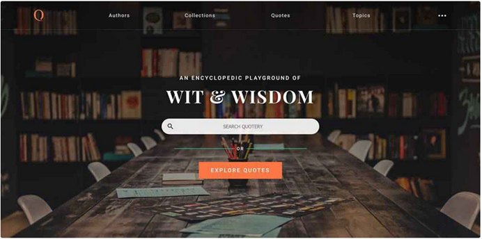
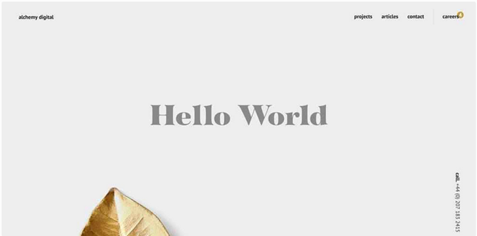
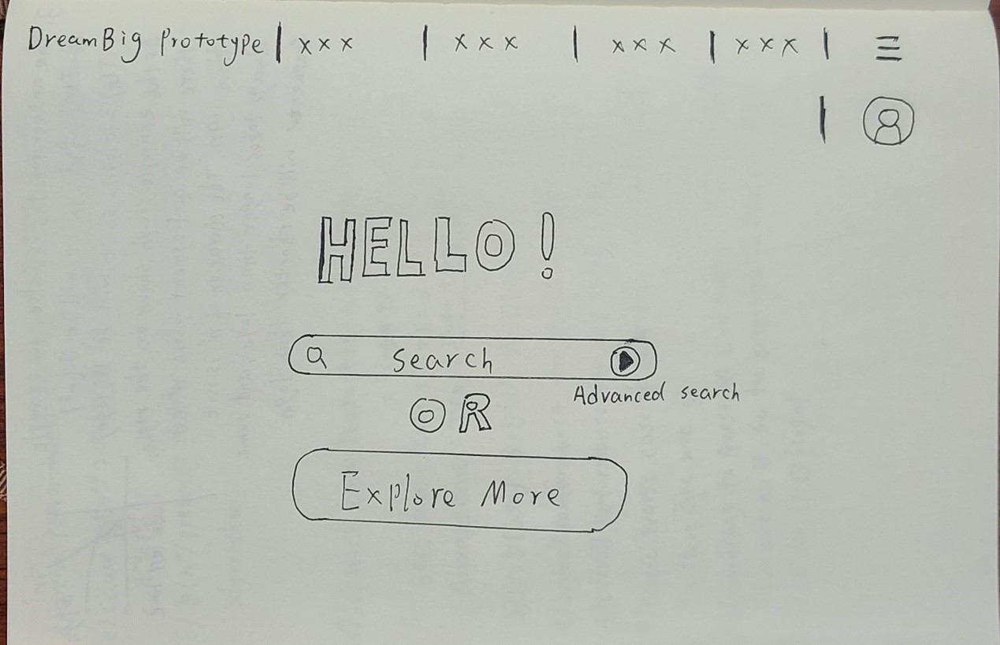
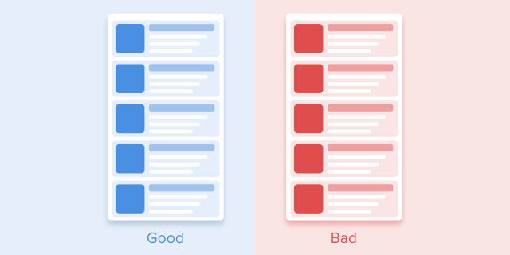

# Individual Research

## UI interface research:

### Example 1:

Links that I think is important for prototype UI design:

1. [https://speckyboy.com/25-beautiful-clean-web-designs/](https://speckyboy.com/25-beautiful-clean-web-designs/)
2. [https://www.webfx.com/blog/web-design/30-beautiful-clean-and-simple-web-designs-for-inspiration/](https://www.webfx.com/blog/web-design/30-beautiful-clean-and-simple-web-designs-for-inspiration/)

Selected pictures from me (I think these pictures would be better for UI prototype):

#### Reason for choosing these two pictures:

I think it’s very good that the navigation bar and search bar of the first picture which can be
highlighted. The interface design allows users to find the contents they need without spending more
time and energy. The second photo is a very clean and simple interface with a lot of blank parts,
which can refresh the user's senses. White background with sunspots can highlight the content of the
web page. If the two are combined, it can give users clear ideas and clean use experience. Following
low-fidelity design is from me.

### Example 2:

Links that I think is important for prototype UI design:

1. [https://uxplanet.org/20-best-website-design-templates-examples-for-your-inspiration-in-2019-ca31e57743de](https://uxplanet.org/20-best-website-design-templates-examples-for-your-inspiration-in-2019-ca31e57743de)

Selected pictures from me (I think these pictures would be better for UI prototype)

Reason to choosing this example: Clear interface, Concise navigation bar, The home page can
highlight what the website does and convey it to users intuitively.

#### For UI and UX

1. UI design: For the UI, we need to put simplicity and practicality first in designing the website.
   Secondly, the appropriate blank space of the web page can make users feel very comfortable.
   Third, highlight the contents that we want to show to the users. For the high-fidelity prototype
   created, we can use Figma to build it.

2. UX design: For the UX design, we can put some animation in website, and I think animation is
   better UX for our website. The benefit of using animation.

- The purpose of animation is aesthetics Animation can be used as a good decoration. The goal of
  animation is usually pure visual goal, which can be accepted by users to a certain extent.
  Animation can help establish an emotional connection between the user and the interface and can
  also stimulate visual attraction to a certain extent. Increase user stickiness.

 (It should be noted that when using animation
effects, the transition time of animation should not be too long)

## Front-end search (Web code implementation):

There are many languages for front-end development. I will list three important and simple
languages.

### 1. HTML:

#### Advantage:

1. Speed up the opening and browsing speed of the page. The static page does not need to connect to
   the database, and the opening speed is significantly higher than that of the dynamic page.
2. The website is more secure, and the HTML page will not be affected by ASP related
   vulnerabilities.
3. Reduce the burden of the server and browse the web without calling the system database.

#### Disadvantage:

1. Too simple. HTML cannot suit the most network devices and applications. For example, mobile
   phones and information appliances cannot directly display HTML. 2. Too large. Due to the
   nonstandard and bloated HTML code, the browser needs to be smart and large enough to display HTML
   correctly.
2. Data and performance are mixed. If you want to change the display of the page, you must remake
   the HTML. To display the same data on different devices, you need to make different HTML.

### 2. Vue:

#### Advantage:

1. Lightweight framework, It has a simple and flexible API, which makes it easier for readers to
   understand and get started faster.
2. Simple and easy to use.
3. Componentization is one of Vue's most powerful functions. Components can extend HTML elements and
   encapsulate reusable code. When components are closely related to HTML and JavaScript in
   development, developers can customize components according to actual needs, making development
   more convenient and greatly reducing the amount of code writing.

#### Disadvantage:

1. It is not suitable for SEO (search engine optimization) optimization, and the encapsulation is
   strong, and the error reporting is not obvious. It is suitable for single person development and
   small and medium-sized projects.

### 3. React:

#### Advantage:

1. It can realize server-side rendering and facilitate search engine optimization.
2. Component, so the code is more modular, and it is easier to reuse the code.
3. React is only the view layer in MVC, and there are no hard requirements for other parts. When
   many developers choose to reconstruct all with angular and part with react, they choose to
   reconstruct part of react.

#### Disadvantage:

1. It is not a complete framework. React-router and flux are basically required to write large-scale
   applications.

Overall: There are many languages to choose from for front-end development, but for me, I think Vue
or React can be a good language for front-end development.

Useful Website link:

1. [https://uigstudio.com/insights/common-web-design-languages-what-they-do-and-why-do-you-need-them](https://uigstudio.com/insights/common-web-design-languages-what-they-do-and-why-do-you-need-them)
2. [https://blog.back4app.com/front-end-programming-languages/](https://blog.back4app.com/front-end-programming-languages/)
