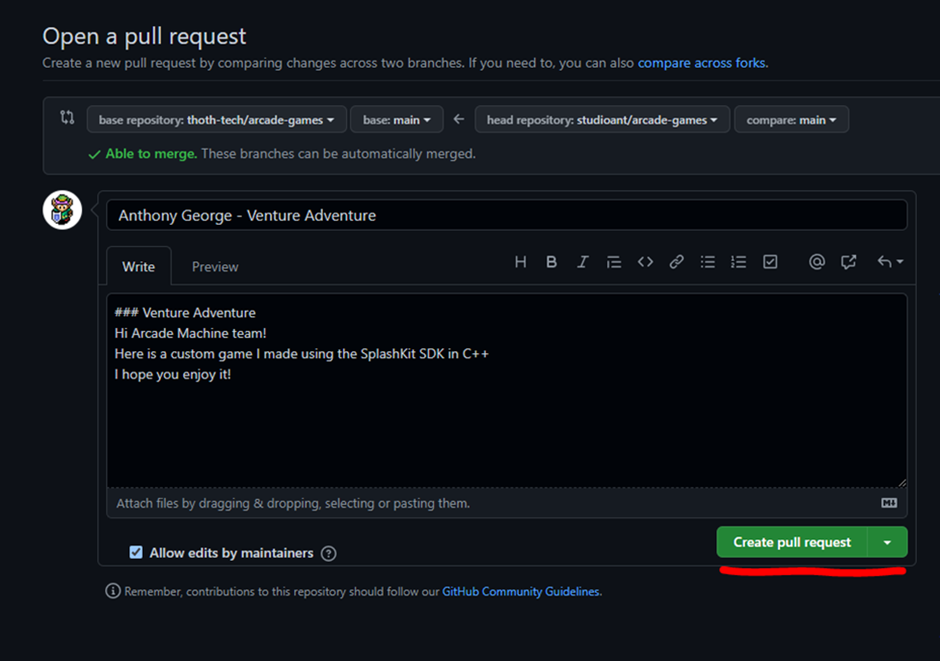

# Guide to Contribute a Game to the Arcade Machine 

### This guide takes you through the steps required for your game to be added into the arcade-machine library.  
---
<br>
Table of contents
   
1. 
2. [Coding](#coding)
   - [Quit Request](#quit-request)
   - [Window Size](#window-size)
   - [Window Border](#window-border)
3. [Controls]()
4. [Compiling]()
5. [Artwork]()
6. [Configuration]()
7. [Content]()
8. [Contributing]()

---

<br>

## **Coding**
To make the game accessible and controllable by the arcade machine, some additional code or changes are required

<br>

### *Quit Request*
Your game must be able to be exited using the escape key
This can be achieved by including the following command in your main loop. 

```cpp
int main()
{
    while(!key_down(ESCAPE_KEY))
    {
        // game play
    }
}
```
<br>

### *Window Size*
The window size of your game cannot exceed 1600 x 900, this is to allow your game to sit neatly inside the arcade-machine itself. Similarly, there is a minimum window size of 640 x 480, to ensure visibility for the user.

<br>

### *Window Border*
We ask that you remove the border before compiling your game. The Arcade Machine provides a more immersive experience for the user if there is no border.
To remove the border of your game window, use SplashKit’s `window_toggle_border();` function after the `open_window()` function like so:
```cpp
int main()
{
    open_window("my game", width, height);
    window_toggle_border("my game");
}
```
<br>

## **Compiling**
Only Windows compiled games are supported atm... 
(Brief windows compilation explanation required here)

<br>

## **Artwork**
A preview of your game will be shown in the Arcade Machine games menu. Please include an image of your game.  
This image must be sized as 600px x 540px so it will be displayed correctly in the games menu.  
The supported formats are png, jpg and bmp.  

If you don’t have access to image editing software such as Adobe Illustrator/Photoshop etc, we suggest you use a browser-based tool such as [resizeimage](https://resizeimage.net/) to resize, crop or format a screenshot of your game. 

<br>

## **Configuration**
Each game must have a config file containing information about the game. 
There is a `config.txt` file located in the base directory of the repository, copy this file into the base directory of your game file and fill it with your game information. It must match the example config file shown below, but with your game information. 

<br>


The configuration file **must** be in text (`.txt`) format, and it must be named `config.txt`.  
This must be located in your games root directory, alongside your `program.cpp` (example below)

<br>


<br>

## **Content**


<br>

## **Contributing**

Congratulations!

You have now completed all the steps required to have your game showcased on the Arcade Machine. 

To contribute your game, go to the [Thoth Tech arcade-games repository](https://github.com/thoth-tech/arcade-games)  
Click the ‘*Fork*’ button at the top right of the screen and create a fork of this repository. 


<br>

You will now have the arcade-games repository in your personal Git. 


<br>

On your local, navigate to a desired file path and clone this repository using the bash command: 
```
git clone https://github.com/<your-git-username>/arcade-games.git 
```
Add your game to the directory and stage a commit to the remote repo: 
```
git add . 
```
In your commit message, include your name and the name of the game: 
```
git commit -m ”Anthony George - Venture Adventure” 
git push 
```
You will now see your game in the remote fork.


<br>
Now create a Pull request to have your game added to the arcade-machine.  

Click the ‘*Pull requests*’ tab, then click ‘*New pull request*’ button, then click '*Create pull request*' 


<br>

Write a message for the Arcade Machine and hit '*Create pull request*'



<br>

You will see that merging is blocked until a member of the Arcade-Machine team has reviewed your game.  
 We will be sure to get in contact with you once it has been approved! 

